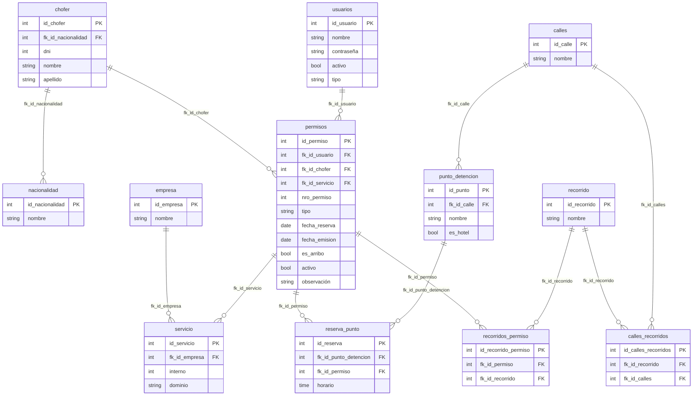

#Sistema de Gestión de Permisos de Circulación

```mermaid
erDiagram
    chofer {
        int id_chofer PK
        int fk_id_nacionalidad FK
        int dni
        string nombre
        string apellido
    }

    nacionalidad {
        int id_nacionalidad PK
        string nombre
    }

    usuarios {
        int id_usuario PK
        string nombre
        string contraseña
        bool activo
        string tipo
    }

    permisos {
        int id_permiso PK
        int fk_id_usuario FK
        int fk_id_chofer FK
        int fk_id_servicio FK
        int nro_permiso
        string tipo
        date fecha_reserva
        date fecha_emision
        bool es_arribo
        bool activo
        string observación
    }

    servicio {
        int id_servicio PK
        int fk_id_empresa FK
        int interno
        string dominio
    }

    empresa {
        int id_empresa PK
        string nombre
    }

    calles {
        int id_calle PK
        string nombre
    }

    punto_detencion {
        int id_punto PK
        int fk_id_calle FK
        string nombre
        bool es_hotel
    }

    recorrido {
        int id_recorrido PK
        string nombre
    }

    calles_recorridos {
        int id_calles_recorridos PK
        int fk_id_recorrido FK
        int fk_id_calles FK
    }

    reserva_punto {
        int id_reserva PK
        int fk_id_punto_detencion FK
        int fk_id_permiso FK
        time horario
    }

    recorridos_permiso {
        int id_recorrido_permiso PK
        int fk_id_permiso FK
        int fk_id_recorrido FK
    }

    chofer ||--o{ nacionalidad : "fk_id_nacionalidad"
    chofer ||--o{ permisos : "fk_id_chofer"
    empresa ||--o{ servicio : "fk_id_empresa"
    usuarios ||--o{ permisos : "fk_id_usuario"
    permisos ||--o{ servicio : "fk_id_servicio"
    permisos ||--o{ reserva_punto : "fk_id_permiso"
    permisos ||--o{ recorridos_permiso : "fk_id_permiso"
    calles ||--o{ punto_detencion : "fk_id_calle"
    punto_detencion ||--o{ reserva_punto : "fk_id_punto_detencion"
    recorrido ||--o{ calles_recorridos : "fk_id_recorrido"
    calles ||--o{ calles_recorridos : "fk_id_calles"
    recorrido ||--o{ recorridos_permiso : "fk_id_recorrido"
```