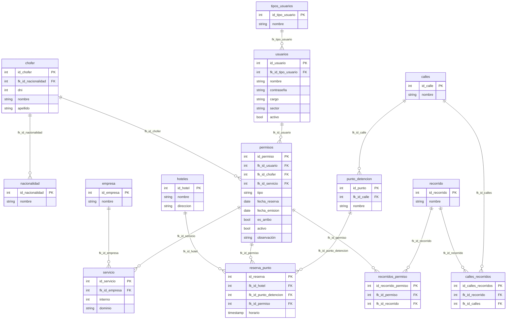

# Sistema de Gestión de Permisos de Circulación

Este sistema esta en desarrollo por la Direccion de Sistemas de la municipalidad de San Carlos de Bariloche, en el marco de pasantias en colaboracion con la Universidad Nacional de Rio Negro.

## Introduccion:
Se busca desarrollar un sistema capaz de gestionar la emisión de permisos de circulación basado en el sistema existente (SLD) con el objetivo de mejorar la accesibilidad y eficiencia de trabajo y centralizar la información generada.

## Modelo de datos:

#### Chofer
| Atributo | Tipo |
|----------|----------|
| id_chofer | int (PK) |
| fk_id_nacionalidad | int (FK) |
| dni | int |
| nombre | string |
| apellido | string |

#### Nacionalidad
| Atributo | Tipo |
|----------|----------|
| id_nacionalidad | int (PK) |
| nombre | string |

#### Usuarios
| Atributo | Tipo |
|----------|----------|
| id_usuario | int (PK) |
| nombre | string |
| contraseña | string |
| activo | bool |
| tipo | string |

#### Permisos
| Atributo | Tipo |
|----------|----------|
| id_permiso | int (PK) |
| fk_id_usuario | int (FK) |
| fk_id_chofer | int (FK) |
| fk_id_servicio | int (FK) |
| nro_permiso | int |
| tipo | string |
| fecha_reserva | date |
| fecha_emision | date |
| es_arribo | bool |
| activo | bool |
| observación | string |

#### Servicio
| Atributo | Tipo |
|----------|----------|
| id_servicio | int (PK) |
| fk_id_empresa | int (FK) |
| interno | int |
| dominio | string |

#### Empresa
| Atributo | Tipo |
|----------|----------|
| id_empresa | int (PK) |
| nombre | string |

#### Calles
| Atributo | Tipo |
|----------|----------|
| id_calle | int (PK) |
| nombre | string |

#### Punto detencion
| Atributo | Tipo |
|----------|----------|
| id_punto | int (PK) |
| fk_id_calle | int (FK) |
| nombre | string |

#### Recorrido
| Atributo | Tipo |
|----------|----------|
| id_recorrido | int (PK) |
| nombre | string |

#### Calles recorridos
| Atributo | Tipo |
|----------|----------|
| id_calles_recorridos | int (PK) |
| fk_id_recorrido | int (FK) |
| fk_id_calles | int (FK) |

#### Hoteles
| Atributo | Tipo |
|----------|----------|
| id_hotel | int (PK) |
| nombre | string |
| direccion | string |

#### Reserva punto
| Atributo | Tipo |
|----------|----------|
| id_reserva | int (PK) |
| fk_id_hotel | int (FK) |
| fk_id_punto_detencion | int (FK) |
| fk_id_permiso | int (FK) |
| horario | timestamp |

#### Recorridos permiso
| Atributo | Tipo |
|----------|----------|
| id_recorrido_permiso |
| fk_id_permiso | int (FK) |
| fk_id_recorrido | int (FK) |

### Diagrama de base de datos:
